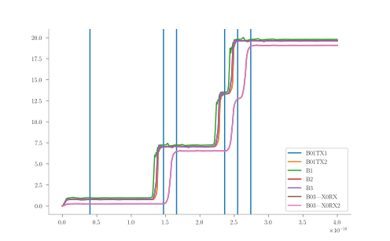

# Configuration File

As stated in the [Introduction](index.md#getting-started), JoSIM Tools is used in the following way:

```bash
$ josim-tools configuration.toml
```

The configuration file is in [TOML](https://github.com/toml-lang/toml ) format with a specific table structure. The contents of this configuration file instruct JoSIM Tools which mode to operate in and relevant settings for that mode.

Apart from this configuration file, JoSIM Tools requires fully operational circuit and a verification files for operation. These files are, however, specified inside the configuration file and is discussed in the [verify](#verify) section.

## Modes

The configuration file should have exactly one mode line, which tells JoSIM Tools what mode to operate in. At present, only the following modes are supported:

 * **[verify](#verify)** - Verify if a circuit works
 * **[margin](#margin)** - Perform a margin analysis on a circuit
 * **[yield](#yield)** - Perform a yield analysis on a circuit
 * **[optimize](#margin)** - Optimize a circuit

Example:

```toml
mode = "verify"
```

## Verify

This mode simply compares the output of a circuit to the provided verification file and reports if this verification was succesful or not.

In order to use the verification mode, a [verify](#verify-table) table needs to be set up inside the configuration file that contains settings relevant to the verification.

### Verify Table

The first item required in the verification table is a method of verification. At present only one method of verification is supported and that is the *specification file (spec)* method. This method compares the simulation results of the input circuit to that of the specified verification *spec* file.

Example:

```toml
mode="verify"

[verify]
method="spec"
```

#### Specification File Verification

This method of verification requires two files to be presented:

1. A fully operational circuit file where the main design is not within a subcircuit.
2. A verification file in the SP (specification file) format.

Example:

```toml
mode="verify"

[verify]
method="spec"
circuit="path_to_circuit_file.cir"
spec_file="path_to_spec_file.sp"
```

#### SP File Format

An SP file consists of a table layout that contains the time points and integer value of 2\(\pi\) phase shifts that each Josephson Junction (JJ) in the circuit undergoes for the duration of the simulation. 

The column headers should be `time` followed by each JJ label name as declared in the circuit file.

The first row following the header should contain a point in time close to the start of the simulation where no JJ switch has occurred. This point is used as a phase calibration offset which is subtracted from each phase value for each junction in the remaining rows.

The remaining lines each contain the integer number of 2\(\pi\) phase shifts that should be expected at the specified time point.

A script to automate the generation of the specification file can be found [here](https://github.com/JoeyDelp/josim-tools/blob/main/scripts/sp_generator.py).

Example spec file:

```
time        B01TX1      B01TX2      B1          B2          B3          B03|X0RX    B03|X0RX2
4.00E-011   0           0           0           0           0           0           0
1.47E-010   1           1           1           1           1           0           0
1.66E-010   1           1           1           1           1           1           1
2.36E-010   2           2           2           2           2           1           1
2.55E-010   3           3           3           3           3           2           2
2.74E-010   3           3           3           3           3           3           3
```

Example visualization:



#### Optional

There is one setting for verification that is optional. This is the threshold command that sets the threshold above which it considers the phase value to be the next integer number. This in essence acts like specifying the threshold at which a decimal is rounded to the next integer.

 * **threshold** - A value specifying how close the phase jumps should be to 2\(\pi\) for it to be considered stable output. When not specified it defaults to **0.05**.

Example:

```toml
threshold=0.35
```

## Margin

A margin analysis tests the margins for each specified component and reports these margins along with the critical margin(s). The configuration file for a margin analysis requires at least 2 tables since all the settings in the [margin table](#margin-table) are optional. The required two tables are the [verify table](#verify-table) and a [parameter table](#parameter-table).

Example:

```toml
mode="margin"

[verify]
method="spec"
circuit="path_to_circuit_file.cir"
spec_file="path_to_spec_file.sp"
```

### Margin Table

The following settings are all optional and dictate how the margin analysis is to be performed.

 * **max_search** - A number specifying the upper boundary of the margin analysis. When not specified it defaults to **1.9** (1 + 90%).
 * **min_search** - A number specifying the lower boundary of the margin analysis. When not specified it defaults to **0.1** (1 - 90%).
 * **scan_steps** - A positive integer specifying the number of scanning steps the margin analysis should take. When not specified it defaults to **4**.
 * **binary_search_steps** - A positive integer specifying the number of binary search steps the margin analysis should do. When not specified defaults to **3**.

Example:

```toml
[margin]
max_search=1.8
min_search=0.2
scan_steps=5
binary_search_steps=4
```

## Parameter Table

The parameter table  is a table used by [margin](#margin), [yield](#yield) and [optimization](#optimization). It consists of a collection of label names that match the labels of components exposed as parameters in the circuit file.

Parameters in this table (at present) require a **nominal** value but can also have an optional **min** and **max** value.

```toml
[parameters]
B01={nominal=2.0}
L01={nominal=2E-12,min=1.8E-12,max=2.2E-12}
L02={nominal=2E-12,min=1.4E-12}
IB01={nominal=14E-5,max=18E-5}
```

Only the parameters in this table will be used when calculating margins (and as a result optimization and yield).

## Yield

Yield analysis calculates the percentage yield of a circuit. This in essence does multiple margin analysis with a certain degree of confidence dependent on the number of samples and reports the successful runs as a percentage. This type of analysis requires [verify](#verify-table), [yield](#yield-table) and [parameters](#parameters-table) tables for successful operation.

Example:

```toml
mode="yield"

[verify]
method="spec"
circuit="path_to_circuit_file.cir"
spec_file="path_to_spec_file.sp"

[parameters]
B01={nominal=2.0}
L01={nominal=2E-12,min=1.8E-12,max=2.2E-12}
L02={nominal=2E-12,min=1.4E-12}
IB01={nominal=14E-5,max=18E-5}
```

### Yield table

The yield table only has one setting that is required for operation:

 * **num_samples** - A positive integer that specifies how many samples the yield analysis should do.

Example:

```toml
[yield]
num_samples=1000
```

## Optimize

The optimize mode repeatedly runs a [margin analysis](#margin) followed by a [verify](#verify) while adjusting [parameters](#parameters-table) between each run in order to try and improve the critical margin(s) of a circuit. The options for optimization are optional and when not provided use default values. This mode requires only the [verify](#verify-table) and [parameters](#parameters-table) tables but also accepts optionally a [margin](#margin-table) table.

Example:

```toml
mode="optimize"

[verify]
method="spec"
circuit="path_to_circuit_file.cir"
spec_file="path_to_spec_file.sp"

[parameters]
B01={nominal=2.0}
L01={nominal=2E-12,min=1.8E-12,max=2.2E-12}
L02={nominal=2E-12,min=1.4E-12}
IB01={nominal=14E-5,max=18E-5}
```

### Optimize table

#### Hybrid optimization

The optimization engine only supports hybrid optimization at present and allows the following optional settings to be altered:

 * **search_radius** - Defines the size of the area surrounding the current best point wherein the next best point should be searched for. If not specified it defaults to a **0.05** wide square around the nominal values of the current best point. 
 * **converge** - Defines how close the estimated guess score should be to the analyzed guess score for converge. If not specified it defaults to **0.01**.
 * **max_iterations** - A positive integer representing the maximum number of guesses the optimization routine will make before terminating due to maximum
   iteration count. If not specified it defaults to **1000**.
 * **output** - The best scored optimization result will be repopulated into the original circuit and stored in this location.

Example:

```toml
[optimize]
method="hybrid"
search_radius=0.1
converge=0.2
max_iterations=500
output="output.cir"
```
