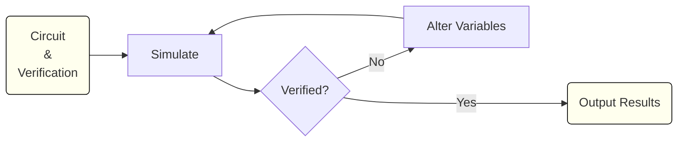

# JoSIM Tools

## Introduction

JoSIM Tools is a set of tools that work with single flux quantum (SFQ) digital superconductor circuits. The tools utilize the [JoSIM](https://github.com/JoeyDelp/JoSIM.git) circuit simulator to perform circuit development tasks including verification of proper operation, optimization, margin analysis, and yield analysis. The code is written in Python and interfaces with the core JoSIM functions through [pyjosim](https://github.com/JoeyDelp/pyjosim.git) which utilizes [pybind11](https://github.com/pybind/pybind11.git) to expose the core C++ functions of JoSIM. JoSIM Tools was originally developed at Stellenbosch University by Dr Paul le Roux.

The goal of the project was to address some of the shortcomings of existing tools such as availability and speed. Close integration with JoSIM core functions allows JoSIM Tools to be reasonably efficient, configurable and programmatically extensible.

The methods implemented within JoSIM Tools use the same basic concept: A circuit for which correct operation can be verified by some method, can be altered and checked again for correct operation. This concept allows algorithms such as margin, yield and optimization to be implemented in a simple loop.



Verification checks the simulated circuit output against the specification file and reports the result. 

Margin analysis varies parameter values until verification fails and reports the largest change that passed as a percentage of the nominal value. 

Yield analysis calculates the probable yield of a circuit as a percentage.

Optimization varies circuit parameters to maximize the margin analysis critical margin. 

## Getting Started

### Requirements

System requirements before installing JoSIM Tools:

- Python 3.6+
- [pyjosim](https://github.com/JoeyDelp/pyjosim.git)
- [poetry](https://pypi.org/project/poetry/)

### Installation

JoSIM Tools installation procedure:

```bash
$ git clone https://github.com/JoeyDelp/josim-tools.git
$ cd josim-tools
$ poetry build --format=wheel
$ pip uninstall josim-tools  # Just in case of older versions
$ pip install ./dist/josim_tools-  # [tab] to auto-complete
```
Example after [tab] to auto-complete (current version might be different): 
```bash
$ pip install ./dist/josim_tools-1.1.7-py3-none-any.whl
```

### Verify

```bash
$ josim-tools -v
JoSIM Tools x.x.x  # Version installed will replace 'x.x.x'
```

### Usage

```bash
$ josim-tools configuration.toml
```

