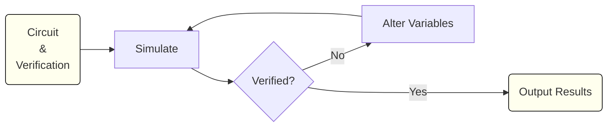

# JoSIM Tools

## Introduction

JoSIM Tools is a set of tools used to analyze Superconducting Flux Quantum circuits originally written by Dr Paul le Roux. The tool utilizes the [JoSIM](https://github.com/JoeyDelp/JoSIM.git) core engine to perform rapid simulations needed to verify, optimize and perform margin and yield analysis. The code is written in Python and interfaces with the core JoSIM functions through [pyjosim](https://github.com/JoeyDelp/pyjosim.git) which utilizes [pybind11](https://github.com/pybind/pybind11.git) to expose the core C++ functions of JoSIM.

The goal of the project was to address some of the shortcomings of available tools such as availability and speed. The close integration with JoSIM core functions allow JoSIM Tools to be reasonably efficient, configurable and programmatically extendable.

The methods implemented within JoSIM Tools revolve around a single core concept. If the provided circuit is operationally correct then a truth can be written to verify the circuit no matter how it is altered. This concept allows algorithms such as margin, yield and optimization to be implemented in a simple loop.



A simple verification will simply test the file against the verification file and report successful verification. 

Margin analysis will test and alter the values to the point where verification failed and report percentages based on the nominal values. 

Yield analysis will run multiple margin analysis with a uncertainty factor based on the number of runs and will report the percentage success.

Optimization will test multiple variations of variables to try and maximize the margin analysis critical margin percentage. 

## Getting Started

### Requirements

Before JoSIM Tools can be installed, the following system requirements need to be met:

- Python 3.6+
- [pyjosim](https://github.com/JoeyDelp/pyjosim.git)
- [poetry](https://pypi.org/project/poetry/)

### Installation

Once requirements are met, JoSIM Tools can be installed:

```bash
$ git clone https://github.com/JoeyDelp/josim-tools.git
$ cd josim-tools
$ poetry build --format=wheel
$ pip install ./dist/josim_tools-1.1.4-py3-none-any.whl
```

### Verify

```bash
$ josim-tools -v
JoSIM Tools 1.1.4
```

### Usage

```bash
$ josim-tools configuration.toml
```

